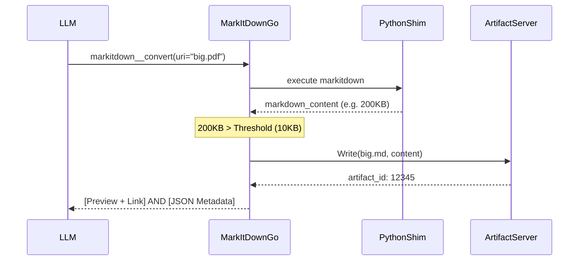

# MLC MarkItDown MCP Server

A robust, high-performance MCP server for converting various document formats to Markdown, featuring smart artifact integration and real-time progress reporting.

## Features

- **Document Conversion**: Uses Microsoft's `markitdown` library to convert PDF, Word, Excel, PowerPoint, HTML, CSV, Images, and Audio.
- **Smart Storage**: Automatically detects large outputs (default > 10,000 characters) and saves them as artifacts instead of flooding the LLM context.
- **Structured Results**: Returns both a human-readable summary and a structured JSON metadata block for every created artifact.
- **Artifact Chaining**: Can convert documents already stored in the `artifact-server` via `artifactId`.
- **Progress Tracking**: Emits real-time progress notifications during long conversion processes.

## Artifact Integration Logic

This server acts as a producer for the `mlcartifact` service.



## Tools

### `markitdown__convert__mlc`
Converts a file path or URL to Markdown.
- **Arguments**:
  - `uri` (string, required): Path to local file or remote URL.
  - `force_artifact` (bool, optional): If true, always saves to artifact storage regardless of size.

### `markitdown__convert_artifact__mlc`
Converts a document that is already stored in the artifact store.
- **Arguments**:
  - `artifactId` (string, required): ID of the source artifact.
  - `output_filename` (string, optional): Desired name for the resulting MD artifact.

### `markitdown__quick_inspect__mlc`
Quickly retrieves metadata about a document without performing full conversion.
- **Arguments**:
  - `uri` (string, required): Path to file.

## Response Strategy

### 1. Human-Readable Notice
When a file is saved as an artifact, the LLM MUST NOT provide a download link. Instead, it should include a clear notice:
> "The complete file is available in the artifact server under id = {id}"

### 2. Structured Metadata
The tool result will contain an additional `TextContent` item with a JSON object:
```json
{
  "artifact": {
    "id": "12345",
    "filename": "document.md",
    "mime_type": "text/markdown",
    "size_bytes": 10240,
    "source": "mlc-markitdown",
    "expires_at": "2026-03-12T05:25:28Z"
  }
}
```

## Configuration

The server requires access to a Python environment with the `markitdown` package installed:
```bash
pip install markitdown
```

## Transport Support
Supports `stdio`, `sse`, and `streamable` HTTP transport modes.
