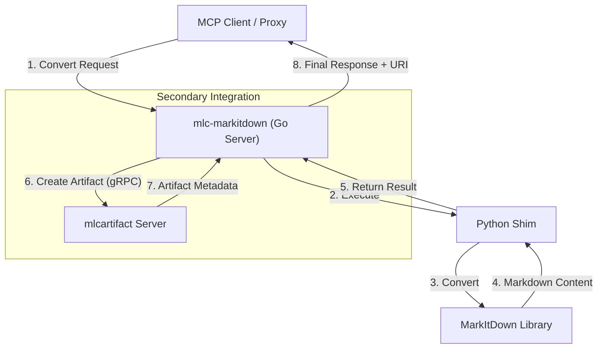
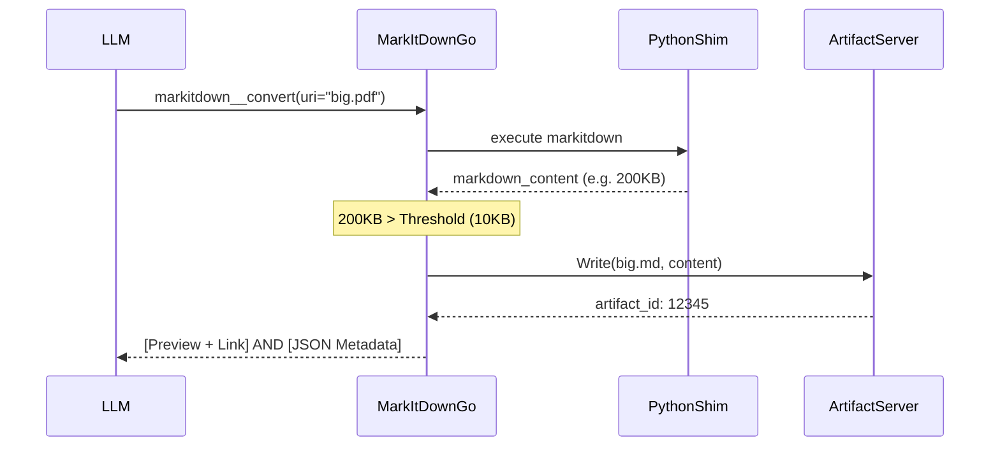

# MLC MarkItDown MCP Server

> **[mlcgo.eu](https://mlcgo.eu)** — tools, libraries and manuals


A robust, high-performance MCP server for converting various document formats to Markdown, featuring smart artifact integration and real-time progress reporting.

## MLC MarkItDown Server

A Go-based server wrapper for Microsoft's `markitdown` library.

## Setup

For detailed instructions on how to set up the Python environment (with or without Docker), please refer to the **[Setup Guide (SETUP.md)](SETUP.md)**.

### Quick Start with Docker

The easiest way to run the server is using Docker, as it includes all system dependencies and the correct Python environment:

```bash
# Build the image
docker build -t mlc-markitdown .

# Run the container
docker run -d \
  -p 9591:9591 \
  -e ARTIFACT_GRPC_ADDR=host.docker.internal:9590 \
  mlc-markitdown
```

## Architecture

The following diagram illustrates how the MLC MarkItDown server integrates with the Python environment and the optional Artifact Server.


```mermaid
graph TD
    Client["MCP Client / Proxy"] -- "1. Convert Request" --> GOS["mlc-markitdown (Go Server)"]
    GOS -- "2. Execute" --> SHIM["Python Shim"]
    SHIM -- "3. Convert" --> MID["MarkItDown Library"]
    MID -- "4. Markdown Content" --> SHIM
    SHIM -- "5. Return Result" --> GOS
    
    subgraph Integration ["Secondary Integration"]
        GOS -- "6. Create Artifact (gRPC)" --> ART["mlcartifact Server"]
        ART -- "7. Artifact Metadata" --> GOS
    end
    
    GOS -- "8. Final Response + URI" --> Client
```

## Features

- **Document Conversion**: Uses Microsoft's `markitdown` library to convert PDF, Word, Excel, PowerPoint, HTML, CSV, Images, and Audio.
- **Vision & Audio**: AI-powered image descriptions and audio transcriptions (via OpenAI or **Ollama** integration).
- **Smart Storage**: Automatically detects large outputs (default > 10,000 characters) and saves them as artifacts instead of flooding the LLM context.
- **Structured Results**: Returns both a human-readable summary and a structured JSON metadata block for every created artifact.
- **Artifact Chaining**: Can convert documents already stored in the `artifact-server` via `artifactId`.
- **Progress Tracking**: Emits real-time progress notifications during long conversion processes.
- **LLM Guidance (Prompts)**: Includes a specialized prompt (`markitdown_instruction`) to guide the LLM on tool usage.
- **High Quality (Score: 95/100)**: Fully validated with `mcp-tester`, featuring complete input and output schemas.

## Artifact Integration Logic

This server acts as a producer for the `mlcartifact` service.


```mermaid
sequenceDiagram
    participant LLM
    participant MarkItDownGo
    participant PythonShim
    participant ArtifactServer

    LLM->>MarkItDownGo: markitdown__convert(uri="big.pdf")
    MarkItDownGo->>PythonShim: execute markitdown
    PythonShim-->>MarkItDownGo: markdown_content (e.g. 200KB)
    Note over MarkItDownGo: 200KB > Threshold (10KB)
    MarkItDownGo->>ArtifactServer: Write(big.md, content)
    ArtifactServer-->>MarkItDownGo: artifact_id: 12345
    MarkItDownGo-->>LLM: [Preview + Link] AND [JSON Metadata]
```

## Tools

### `markitdown__convert__mlc`
Converts a file path or URL to Markdown.
- **Arguments**:
  - `uri` (string, required): Path to local file or remote URL.
  - `force_artifact` (bool, optional): If true, always saves to artifact storage regardless of size.
  - `enable_vision` (bool, optional): If true, use an LLM for image descriptions or audio transcription.
  - `llm_provider` (string, optional): 'openai' or 'ollama'.
  - `ollama_model` (string, optional): Model name (e.g. 'llama3.2-vision').
  - `ollama_url` (string, optional): Ollama API URL.

### `markitdown__convert_artifact__mlc`
Converts a document that is already stored in the artifact store.
- **Arguments**:
  - `artifactId` (string, required): ID of the source artifact.
  - `output_filename` (string, optional): Desired name for the resulting MD artifact.
  - `enable_vision` (bool, optional): If true, use an LLM for image descriptions or audio transcription.
  - `llm_provider` (string, optional): 'openai' or 'ollama'.
  - `ollama_model` (string, optional): Model name (e.g. 'llama3.2-vision').
  - `ollama_url` (string, optional): Ollama API URL.

### `markitdown__quick_inspect__mlc`
Quickly retrieves metadata about a document without performing full conversion.
- **Arguments**:
  - `uri` (string, required): Path to file.

### `markitdown__list_models__mlc`
Lists available models from an OpenAI-compatible LLM provider.
- **Arguments**:
  - `base_url` (string, optional): Custom base URL (e.g., Ollama).
  - `api_key` (string, optional): API key if required.

## Response Strategy

### 1. Human-Readable Notice
When a file is saved as an artifact, the LLM MUST NOT provide a download link. Instead, it should include a clear notice:
> "The complete file is available in the artifact server under id = {id}"

### 2. Structured Metadata
The tool result will contain an additional `TextContent` item with a JSON object:
```json
{
  "artifact": {
    "id": "12345",
    "filename": "document.md",
    "mime_type": "text/markdown",
    "size_bytes": 10240,
    "source": "mlc-markitdown",
    "expires_at": "2026-03-12T05:25:28Z"
  }
}
```

## Prompts

### `markitdown_instruction`
A specialized instruction prompt for the LLM. It can be retrieved to provide system-level guidance on:
- Choosing the right conversion tool.
- Handling large file artifact notices.
- Using `quick_inspect` for metadata before conversion.

## Configuration

The server can be configured via environment variables. See **[SETUP.md](SETUP.md)** for details.

| Variable | Description | Default |
|----------|-------------|---------|
| `DEFAULT_LLM_PROVIDER` | 'openai' or 'ollama' | `openai` |
| `DEFAULT_LLM_URL` | Base URL for LLM API | - |
| `DEFAULT_LLM_MODEL` | Default model for vision/audio | `gpt-4o` or `llama3.2-vision` |
| `DEFAULT_LLM_AUTH_KEY` | Default API key | - |
| `PYTHON_CMD` | Python command | `python3` |
| `ARTIFACT_GRPC_ADDR` | Artifact server address | `localhost:9590` |

## Transport Support
Supports `stdio`, `sse`, and `streamable` HTTP transport modes.

## Development & Testing

This project uses **[mcp-tester](https://github.com/hmsoft0815/mlc_mcptester)** for automated integration testing and quality inspection. 

To run all tests:
```bash
make test              # Run unit tests
make test-integration  # Run mcp-tester script
```
For more details, see **[TESTING.md](TESTING.md)**.

## Reference

The **[MCP Handbook](https://mlcgo.eu/books/mcp-handbuch/)** explains the Model Context Protocol from the ground
up — tools, resources, prompts, transports, security and the artifact pattern.
Available in English and German.

---

## License

This project is licensed under the MIT License - see the [LICENSE](LICENSE) file for details.

Copyright (c) 2026 Michael Lechner
